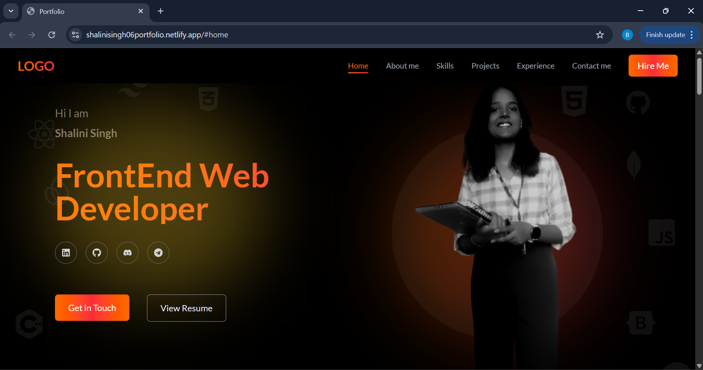
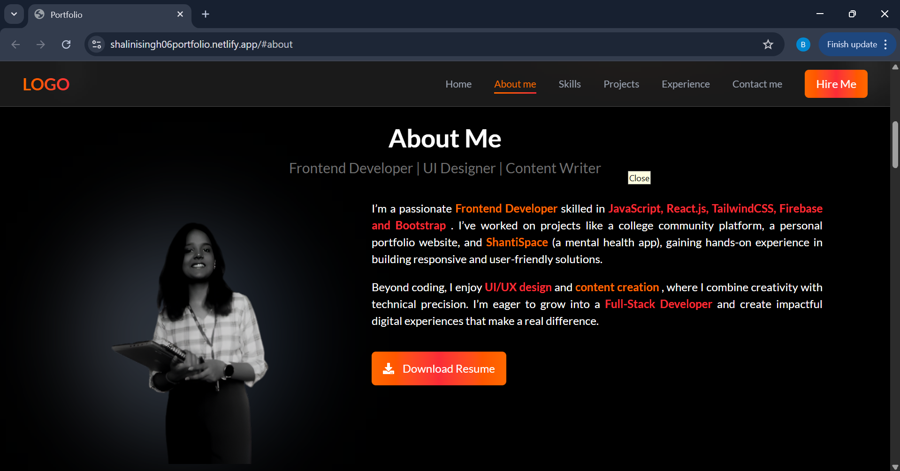
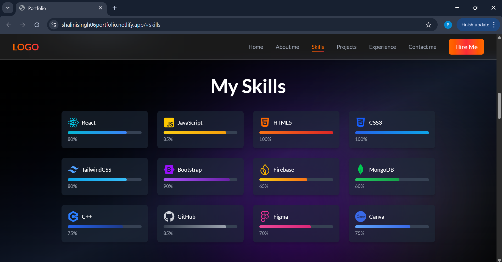
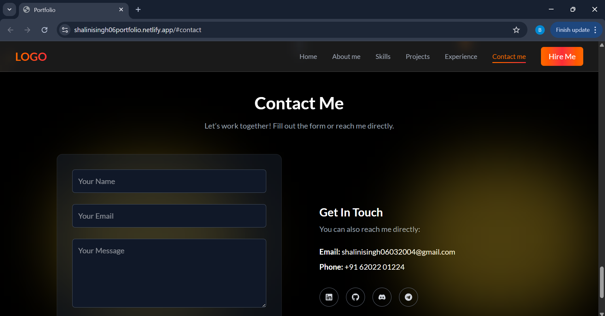

# 🌐 Portfolio Website

A modern and responsive **personal portfolio website** built with **React + Vite**, designed to showcase my skills, projects, and experience as a front-end developer aspiring to become a full-stack developer.

## ✨ Features

- ⚡ Built with **React + Vite** for fast performance and HMR
- 🎨 Styled with **Tailwind CSS** for a sleek, responsive UI
- 🎭 Smooth animations with **Framer Motion**
- 🌌 Interactive background effects (Particles, Floating Icons)
- 🔗 Social media integration (LinkedIn, GitHub, Telegram, Discord)
- 📩 Contact form with **Nodemailer** for sending messages directly to my email
- 🗄️ Contact messages stored securely in **MongoDB** for future reference
- 📱 Fully responsive design for all devices

## 🛠️ Tech Stack

- **Frontend:** React, Vite, Tailwind CSS, Framer Motion
- **Backend:** Node.js, Express
- **Database:** MongoDB
- **Email Service:** Nodemailer
- **Icons & Graphics:** React Icons
- **Deployment:** Netlify (Frontend), Render/Heroku (Backend)

## 📂 Project Structure

```
portfolio/
├── public/              # Static assets
├── src/
│   ├── components/      # Reusable UI components
│   ├── assets/          # Images and icons
│   ├── App.jsx          # Main app component
│   ├── main.jsx         # React entry point
│   └── styles/          # Global styles
├── backend/             # Backend folder
│   └── server.js        # Express server with Nodemailer + MongoDB
├── package.json
└── vite.config.js
```

## 🚀 Getting Started

Clone the repository and install dependencies:

```bash
# Clone the repo
git clone https://github.com/yourusername/portfolio.git

# Navigate to project folder
cd portfolio

# Install dependencies
npm install

# Start frontend (React + Vite)
npm run dev
```

Run the backend server:

```bash
# Navigate to backend folder
cd backend

# Install backend dependencies
npm install

# Start server
node server.js
```

📸 Preview

<p align="center">
  <br>
  <br>
  <br>
  
</p>

🌍 Live Demo
👉 Visit My Portfolio

💡 This portfolio is a continuous work in progress, showcasing my journey as a developer.
